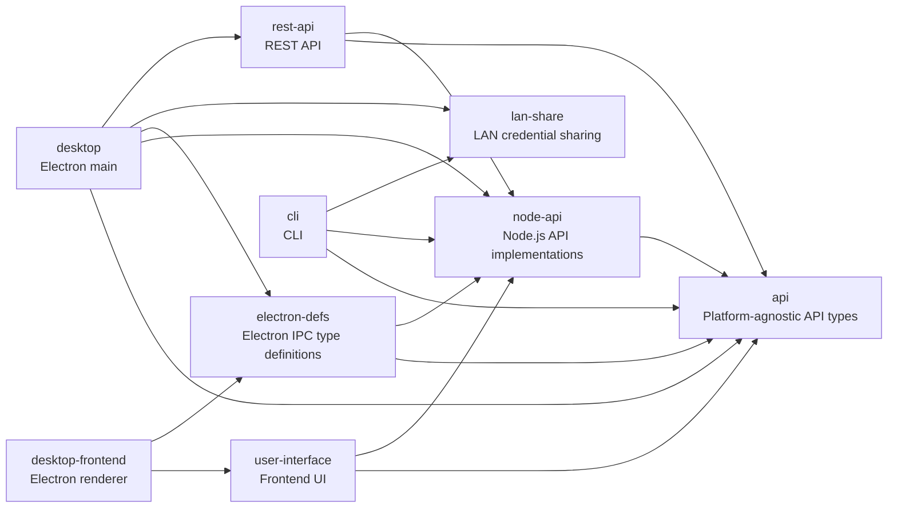

# Dependencies

```mermaid
flowchart LR
    edefs["electron-defs<br/>Electron IPC type definitions"]
    lanshare["lan-share<br/>LAN credential sharing"]
    api["api<br/>Platform-agnostic API types"]
    nodeapi["node-api<br/>Node.js API implementations"]
    restapi["rest-api<br/>REST API"]
    ui["user-interface<br/>Frontend UI"]
    cli["cli<br/>CLI"]
    desktop["desktop<br/>Electron main"]
    desktopfe["desktop-frontend<br/>Electron renderer"]

    nodeapi --> api
    edefs --> api & nodeapi
    restapi --> api & nodeapi
    ui --> api & nodeapi
    cli --> api & nodeapi & lanshare
    desktop --> api & nodeapi & edefs & lanshare & restapi
    desktopfe --> ui & edefs
```
