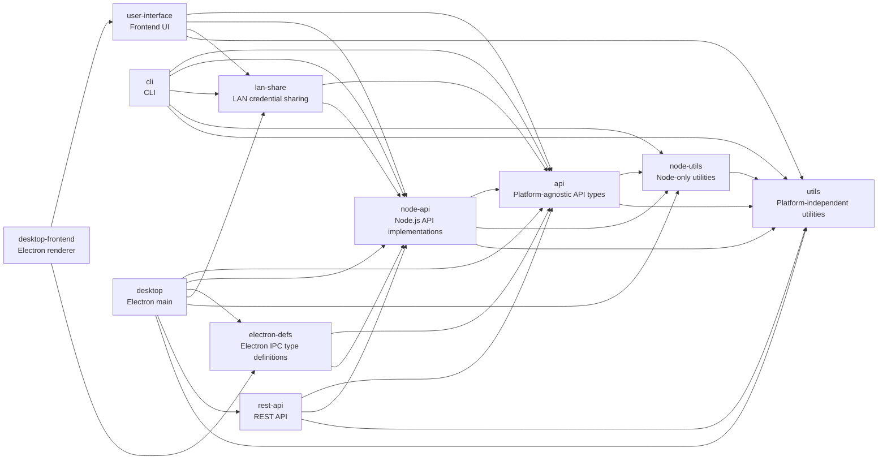

# Dependencies

```mermaid
flowchart LR
    utils["utils<br/>Platform-independent utilities"]
    edefs["electron-defs<br/>Electron IPC type definitions"]
    nodeutils["node-utils<br/>Node-only utilities"]
    lanshare["lan-share<br/>LAN credential sharing"]
    api["api<br/>Platform-agnostic API types"]
    nodeapi["node-api<br/>Node.js API implementations"]
    restapi["rest-api<br/>REST API"]
    ui["user-interface<br/>Frontend UI"]
    cli["cli<br/>CLI"]
    desktop["desktop<br/>Electron main"]
    desktopfe["desktop-frontend<br/>Electron renderer"]

    nodeutils --> utils
    api --> nodeutils & utils
    nodeapi --> api & nodeutils & utils
    lanshare --> api & nodeapi
    edefs --> api & nodeapi
    restapi --> api & nodeapi & utils
    ui --> api & nodeapi & lanshare & utils
    cli --> api & nodeapi & lanshare & nodeutils & utils
    desktop --> api & nodeapi & edefs & lanshare & nodeutils & restapi & utils
    desktopfe --> ui & edefs
```
