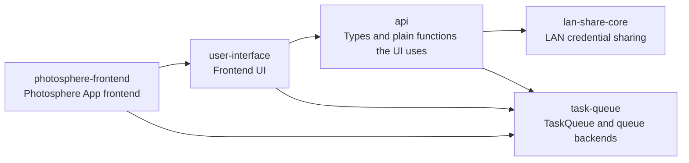

# Dependencies

```mermaid
flowchart LR
    lanshare["lan-share-core<br/>LAN credential sharing"]
    taskqueue["task-queue<br/>TaskQueue and queue backends"]
    api["api<br/>Types and plain functions the UI uses"]
    ui["user-interface<br/>Frontend UI"]
    frontend["photosphere-frontend<br/>Photosphere App frontend"]

    api --> lanshare & taskqueue
    ui --> api & taskqueue
    frontend --> ui & taskqueue
```
