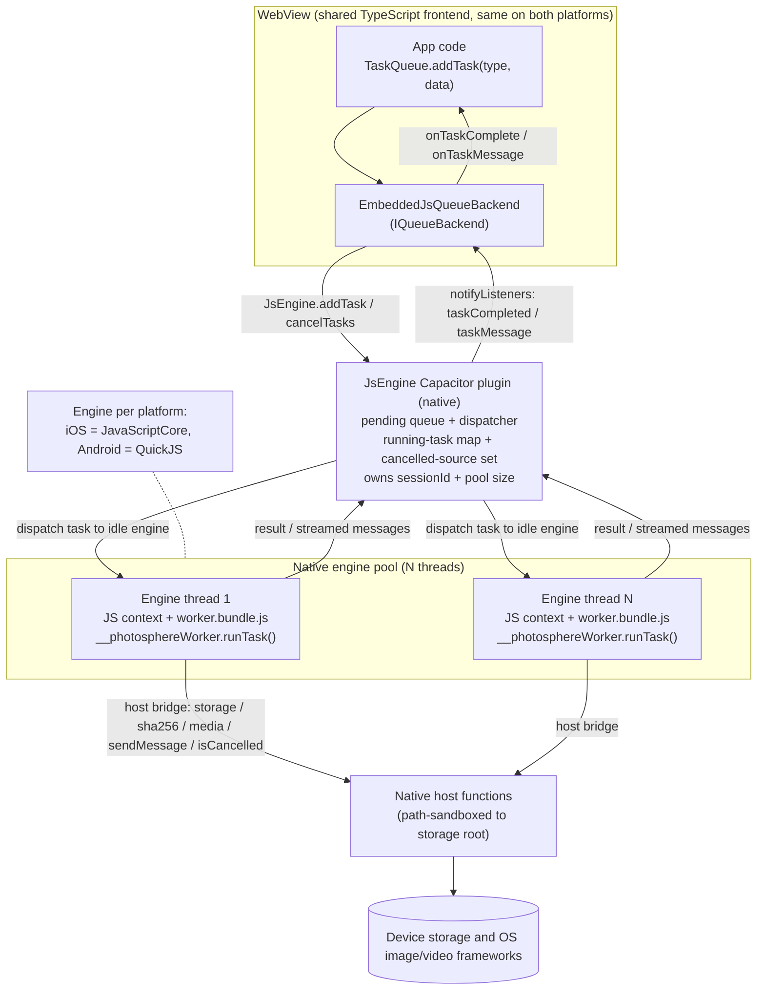

# Mobile Background Tasks: Plan (Embedded JS Engine)

## Issues

Found by `/plan:check`. Check each off as it is addressed.

- [x] 1. (Missing) Sync/async bridge mismatch: `IQueueBackend.addTask` is synchronous and must return the taskId immediately, but Capacitor plugin calls return Promises. State that `JsEngine.addTask` must be fire-and-forget (id generated locally, like the Electron `send` path) and specify how the un-awaited dispatch promise's rejection is handled.
- [x] 2. (Missing) Capacitor `addListener` is async (returns `Promise<PluginListenerHandle>`) while Electron registers listeners synchronously. Address the race where `taskCompleted`/`taskMessage` can fire before the listener resolves, and listener-handle cleanup.
- [x] 3. (Missing) Ownership of `EmbeddedJsQueueBackend` is unspecified: android and ios `mobile-queue-backend.ts` are currently byte-identical duplicates. Decide shared module vs per-app duplication. Same for the location of `mobile-worker-entry.ts`.
- [x] 4. (Missing) Pool size configuration source is unspecified (build constant vs runtime setting vs device detection).
- [x] 5. (Missing) `shutdown()` behaviour for the pool/plugin (engine-thread teardown, Capacitor listener removal) is not described.
- [x] 6. (Missing) `sessionId` ownership on mobile is unspecified; pin which side owns it and how it stays consistent with the WebView session.
- [x] 7. (Missing) Inventory grep list omits network APIs (`http`/`https`/`net`/`tls`/`fetch`); confirm nothing bundled needs them once storage is replaced by `HostStorage`.
- [x] 8. (Inconsistency) Components names only the android backend path, but step 8 wires both android and ios `app.tsx`; specify the ios side.
- [x] 9. (Inconsistency) "reuse the prototype's `build:bundle`/`copy:bundle` scripts" and "`JsRunner` ... reused": the prototype is a separate repo, so these are re-created/ported here, not reused. Reword.
- [x] 10. (Inconsistency) Worker-entry location named two ways ("packages/api (or a new packages/mobile-worker)"); existing worker entries live under `apps/`. Settle the location.
- [x] 11. (Issue) Bundle global exposure: rely solely on the entry's manual `globalThis.__photosphereWorker = { runTask }` assignment under `bun build --format=iife`, and do not also set a bundler global-name, so the two mechanisms cannot collide.
- [x] 12. (Issue) Global name `Worker` shadows the built-in Web Worker constructor and can collide in the Bun / `quickjs-emscripten` parity harnesses; use the non-colliding name `__photosphereWorker`.
- [x] 13. (Issue) Whole-file base64 marshalling of bytes across the bridge risks OOM for large assets; consider streaming/file-handle for large blobs beyond the `host.sha256` hashing path.
- [x] 14. (Issue) Synchronous `isCancelled()`/`sendMessage()` require native sync callables touching a lock-guarded shared set from inside a running task; confirm both engine bindings support this and the lock is safe for a sync mid-task call.
- [x] 15. (Tests) No native unit test for the pool dispatcher (FIFO order, idle-slot assignment, cancel-drops-pending, concurrency cap, size-1 serial). Add direct dispatcher tests on both platforms.
- [x] 16. (Tests) No test for the addTask fire-and-forget / dispatch-rejection path, nor the addListener race/cleanup.
- [x] 17. (Tests) No large-payload base64 round-trip test (the OOM-risk path).
- [x] 18. (Tests) Cancellation of a pending (not running) task is not a distinct test case.
- [x] 19. (Docs) `docs/background-tasks.md` is not updated for the mobile/embedded-engine path.
- [x] 20. (Docs) CLAUDE.md Mobile/Architecture section is not updated to mention the embedded JS engine + host bridge.
- [x] 21. (Docs) The host-bridge checklist file's repo location is not fixed.
- [x] 22. (Security) Path traversal: native storage host functions take JS/task-supplied path strings; sandbox to the storage root and reject `..`/absolute paths.
- [x] 23. (Security) State that `worker.bundle.js` is only ever eval'd from the packaged app asset, never a remote/OTA source.

## How it works (Android and iOS)
The flow is identical on both platforms; only the engine implementation differs (iOS uses JavaScriptCore, Android uses QuickJS).

## Overview
Background tasks on mobile will be implemented by running the existing task handlers as JavaScript inside a JS interpreter embedded in the app's native code, driven from native, off the WebView. This is the approach proven by the standalone `capacitor-embedded-javascript-prototype` repo (a separate project outside this monorepo). This plan records the chosen engines and specifies how the worker code is compiled and packaged for the engine, and how tasks are dispatched into it and results/events flow back to the web app.

The orchestration layer (`packages/task-queue`) stays in TypeScript and is reused. The handlers (`packages/node-api/src/lib/*.worker.ts`) are compiled to a single JS bundle and executed by the embedded engine, with their Node dependencies (`fs`, native tools) replaced by a host bridge into native code. The rest of the app is unchanged: it keeps using `TaskQueue` against an `IQueueBackend`, exactly as on desktop.

## Terminology
- **Task**: a single unit of work with a `type` (for example `hash-file`, `load-assets`, `import-assets`) and input `data`, dispatched through the task queue and run by a registered handler. A task returns a result, can stream progress messages, can be cancelled, and is tagged with a `source` string that groups related tasks. Defined in `packages/task-queue`.
- **Background task**: a task, emphasising that it runs off the UI/main thread in a worker. In this codebase every task is a background task; the terms are used interchangeably for the worker-level unit of work. This plan is about running background tasks on mobile.
- **Task queue** (`TaskQueue` / `IQueueBackend`, `packages/task-queue`): the mechanism that accepts tasks (`addTask`), dispatches them to a backend, and returns results and streamed messages (`awaitTask`, `onTaskComplete`, `onTaskMessage`). `TaskQueue` is the caller-facing API; `IQueueBackend` is the pluggable executor/transport behind it.
- **Worker pool**: an `IQueueBackend` implementation that owns a set of workers (OS threads, processes, or embedded JS engine instances) and runs task handlers across them in parallel. Examples: `WorkerPoolBun` (CLI), `WorkerPoolElectronMain` (desktop), and the mobile engine pool defined by this plan. Proxy backends (`ElectronRendererQueueBackend`, `EmbeddedJsQueueBackend`) forward to a pool that lives elsewhere rather than owning workers themselves.
- **Background job** (`IJob`, the Job Manager, `plan-job-manager.md`): a user-visible background activity shown in the navbar/sidebar with a name, progress, and optional Cancel. A job is higher-level than a task: it represents what the user sees and may aggregate one or more underlying tasks that share a `source`/`sourceTag`. Cancelling a job cancels those tasks via `platform.cancelTasks(sourceTag)`.

## Chosen engines (from the prototype)
The prototype implemented and tested all ranked engine options on device. The picks:
- iOS: JavaScriptCore (prototype branch `engine/ios-javascriptcore`). System framework, no third-party dependency, real `async`/Promise support, JIT. Confirmed working on device.
- Android: QuickJS via the Quack JNI binding (prototype branch `engine/android-quickjs`). Small, real `async`/Promise support. Confirmed working on device.
- Android fallback: Rhino (`engine/android-rhino`) is pure-JVM with no NDK and also worked, but it has no `async`/`await`, so the prototype stripped async to run it. The real handlers are heavily asynchronous, so Rhino is only a fallback for a synchronous-only subset and is not the target. iOS Duktape (`engine/ios-duktape`) is likewise a proven fallback but ES5-only.

Async support is the deciding factor: the handlers use `async`/`await` throughout, and both JavaScriptCore and QuickJS run real promises, so the handlers run unchanged.

## How the prototype maps to this work
The prototype is a separate repo and proved the core round trip with a toy task (`levenshtein`). This plan re-creates that exact mechanism here in the monorepo and scales it up to the real handlers. Nothing is imported from the prototype repo; its code is the reference implementation to port from:
- Prototype `task.bundle.js` (one toy function) becomes `worker.bundle.js` (all handlers plus the task-queue runtime).
- Prototype `host` bridge (`log`, `getInput`) grows into the full host bridge (`log`, `sendMessage`, `isCancelled`, storage, media tools).
- Prototype `JsEngine.runTask` (one-shot) becomes a queue-backed plugin that runs many tasks and streams messages and completion events.
- Prototype `JsRunner` (JSC / QuickJS) implementations are ported here as the engine hosts (re-created in this repo, not referenced across repos).

## Integration Design

### Ownership: one shared mobile package, no per-app duplication
Today `apps/android-frontend/src/lib/mobile-queue-backend.ts` and `apps/ios-frontend/src/lib/mobile-queue-backend.ts` are byte-identical, as are the two `platform-provider-mobile.tsx`. This plan does not deepen that duplication. Instead:
- Create a shared workspace package `packages/mobile-frontend` that holds the TypeScript that is identical across the two mobile apps: `EmbeddedJsQueueBackend`, the `JsEngine` Capacitor plugin JS interface (`registerPlugin`), and the shared `platform-provider-mobile` logic. Both `apps/android-frontend` and `apps/ios-frontend` add it as a `workspace:*` dependency and re-export/mount it. The existing byte-identical `mobile-queue-backend.ts` / `platform-provider-mobile.tsx` files are replaced by thin imports from this package.
- The embedded worker entry and its bundle live in a separate shared workspace package `packages/mobile-worker` (entry `mobile-worker-entry.ts`, build scripts, and the built `worker.bundle.js`). Existing worker entries (`apps/cli/worker.ts`, `apps/desktop/src/worker.ts`) live under `apps/` because each is app-specific; the mobile worker bundle is shared byte-for-byte by both mobile apps and is consumed by native code, so it belongs in one package that both native projects copy from, not under either app.
- The native plugin code (Swift, Java) is inherently per-platform and stays in each native project (`apps/android-frontend/android`, `apps/ios-frontend/ios`); only the JS/TS that was duplicated is consolidated.

### Components
- Web (WebView, TypeScript), in `packages/mobile-frontend`: `EmbeddedJsQueueBackend implements IQueueBackend`, replacing the current no-op `MobileQueueBackend`. It forwards `addTask` / `cancelTasks` to the native `JsEngine` Capacitor plugin and turns plugin events back into `IQueueBackend` callbacks. This mirrors `ElectronRendererQueueBackend` (`apps/desktop-frontend/src/lib/electron-renderer-queue-backend.ts`), which does the same over Electron IPC. Both `apps/android-frontend/src/app.tsx` and `apps/ios-frontend/src/app.tsx` import it from the shared package and call `setQueueBackend(new EmbeddedJsQueueBackend())` (after awaiting its listener init; see the lifecycle section).
- Native (`JsEngine` Capacitor plugin, our own code, per platform): owns a pool of embedded engine instances (see the concurrency model below), maintains the pending-task queue, a running-task map, a cancelled-source set, and the single `sessionId`, installs the host bridge into each engine, and emits `taskCompleted` / `taskMessage` events to the WebView via Capacitor's `notifyListeners`.
- Embedded JS (`worker.bundle.js`, built from `packages/mobile-worker`): the compiled handlers plus a thin mobile worker runtime that exposes `globalThis.__photosphereWorker.runTask(taskId, type, dataJson)`, builds an `ITaskContext` backed by the host bridge, and calls the existing `executeTaskHandler` from the task-queue registry. The same bundle is loaded independently into each engine in the pool.

### Concurrency model: a pool of engine threads (the mobile worker pool)
A single JS engine is single-threaded, so one engine cannot run two CPU-bound tasks at once. To match the desktop behaviour (for example loading assets and importing assets at the same time), the native plugin runs a pool of engine instances, one per native thread, mirroring the desktop worker pools (`apps/cli/src/lib/worker-pool-bun.ts`, `apps/desktop/src/lib/worker-pool-electron-main.ts`).
- Each pool slot is a native thread (iOS `DispatchQueue` / `Thread`, Android a thread in an `ExecutorService`) owning its own JS engine context (JavaScriptCore on iOS, QuickJS on Android) with its own copy of `worker.bundle.js` evaluated once and its own `host` bridge installed. Engine contexts are not shared between threads (neither JSC nor QuickJS contexts are thread-safe).
- The plugin keeps a pending-task FIFO. `addTask` enqueues; a dispatcher hands the next pending task to any idle engine. When an engine finishes, it picks up the next task. This gives true parallelism up to the pool size.
- Within a single engine, async handlers still interleave on its event loop, so an engine awaiting a host call is not blocked; the pool adds CPU parallelism on top of that.
- Cancellation is by source across the whole pool: `cancelTasks(source)` adds the source to the shared cancelled set and drops matching pending tasks; any engine currently running a task for that source observes it via `host.isCancelled(taskId)`.
- Host functions are called concurrently from multiple engine threads, so every native host function (storage IO, `sha256`, media tools, `sendMessage`) must be thread-safe. The shared structures (pending queue, running-task map, cancelled set) must be guarded by a lock.

#### Pool size configuration source
Pool size is a single build-time constant in the plugin (`POOL_SIZE`, default 3), defined once per platform and documented as the only source of truth. This plan does not add a runtime setting or device-capability detection; those are deferred. Rationale: each engine costs memory (its own context plus a copy of the bundle), the right small default is the same across current target devices, and a constant keeps the dispatcher trivially testable. A size of 1 degrades gracefully to serial execution and is a supported, tested configuration (see the size-1 dispatcher test). If a runtime/tunable source is wanted later, it replaces this constant; until then nothing else reads or writes pool size.

### Lifecycle, threading, and the sync/async bridge
`IQueueBackend` is fully synchronous (`addTask` returns the id immediately), but Capacitor plugin calls and `addListener` return Promises. This section pins how the backend bridges the two without races or lost events.

1. `addTask` is fire-and-forget, exactly like the Electron `send` path (`electron-renderer-queue-backend.ts:149`). The taskId is generated locally in JS (`taskId ?? crypto.randomUUID()`) and returned synchronously; `JsEngine.addTask({ taskId, type, data, source })` is invoked but its Promise is not awaited. A `.catch` is attached to that Promise: if the bridge call itself rejects (plugin not registered, marshalling failure), the backend synthesises a local `taskCompleted` event for that taskId carrying an error result, so the task fails loudly through the normal completion path and `awaitTask` rejects, rather than hanging forever. `onTaskAdded` callbacks fire synchronously after the call is dispatched, matching Electron.
2. Listener registration is async, so it is done once during app bootstrap before any task can be dispatched. `EmbeddedJsQueueBackend` exposes `async init()` that calls `JsEngine.addListener("taskCompleted", ...)` and `JsEngine.addListener("taskMessage", ...)`, awaits both `PluginListenerHandle`s, and stores them. App bootstrap awaits `backend.init()` before `setQueueBackend(backend)` and before the UI can mount anything that dispatches tasks, so a listener is always registered before the first `addTask`. As belt-and-suspenders against any event arriving before a listener is attached, the native plugin buffers `taskCompleted` / `taskMessage` events per-taskId while no listener is registered and flushes them on first listener registration; this closes the window even if a task were dispatched during startup.
3. `sessionId` is owned by the native plugin, mirroring desktop where the main process generates it once (`apps/desktop/src/main.ts:916`) and passes it into every worker. The plugin generates one `sessionId` when the pool initialises and passes it into each engine's `runTask` context, so all engines and all tasks in the pool share one consistent `sessionId` (the value write locks in `packages/node-api` are keyed on). The WebView's own session is separate and is not used for task execution, so there is no cross-thread session to keep in sync; the single native owner is the source of truth.
4. `shutdown()` releases everything: the backend calls `handle.remove()` on each stored `PluginListenerHandle` (the Capacitor equivalent of Electron's `removeAllListeners`) and then calls `JsEngine.shutdown()`. Native `shutdown` stops the dispatcher, drains/abandons the pending FIFO, signals running engines to stop, tears down each engine thread (terminate the `ExecutorService` / dispatch queues, dispose every `JSContext` / QuickJS context), removes the host bridges, and clears the shared structures (pending queue, running-task map, cancelled set). The plugin is also torn down on app teardown so engine threads never outlive the plugin.
5. Synchronous host calls mid-task: `context.isCancelled()` and `context.sendMessage()` are synchronous in `ITaskContext`, so the embedded code calls `host.isCancelled(taskId)` and `host.sendMessage(taskId, json)` as synchronous native callables from inside a running handler. Both engines support this: JSC via `JSObjectMakeFunctionWithCallback` (synchronous JS→native), QuickJS/Quack via a synchronous bound native function; the prototype already proved synchronous host callables (`log`, `getInput`). To keep the sync path safe: `isCancelled` reads a per-source/per-task cancelled flag held as an atomic/volatile value, so the read needs no lock (no lock acquired from inside a running task for cancellation checks); `sendMessage` acquires a short-held lock only around the `notifyListeners` hand-off, which does not call back into the engine, so there is no lock-ordering hazard or re-entrancy with the engine event loop. Mutating the cancelled set (from `cancelTasks`) takes the same short lock and updates the atomic flags.

### Concern 1: compiling and packaging the worker .ts for the engine
1. Add `packages/mobile-worker/mobile-worker-entry.ts` that calls `initTaskHandlers()` (registers every handler) and assigns `globalThis.__photosphereWorker = { runTask }`, where `runTask(taskId, type, dataJson)` parses the data, builds an `ITaskContext`, and `await`s `executeTaskHandler(type, data, context)`. The global is named `__photosphereWorker` (not `Worker`) so it never shadows the built-in Web Worker constructor and cannot collide in the Bun / `quickjs-emscripten` parity harnesses.
2. Bundle it with `bun build` into `worker.bundle.js`, using the repo's standard bundler (the same `bun build` used by `apps/desktop` and `apps/cli`): `bun build ./mobile-worker-entry.ts --outfile worker.bundle.js --format=iife --target=browser`. The entry assigns `globalThis.__photosphereWorker` itself; no bundler global-name (`--global-name`) is set, so the manual assignment is the single exposure mechanism and the two cannot collide. JavaScriptCore and QuickJS both support modern ES and real promises, so async handlers need no transpile.
3. Replace Node-only dependencies at bundle time so the bundle is self-contained and engine-runnable (the complete set is governed by the Node API inventory below). The main categories:
   - Storage: swap `openStorage` / the Node `FileStorage` for a `HostStorage` that implements `IStorage` by calling host bridge functions (`host.storageRead`, `host.storageWrite`, `host.storageList`, `host.storageDelete`, `host.storageStat`). Native implements these against the device storage backend selected in `plan-mobile-storage-options.md`. Use a `bun build` alias (a Bun build plugin or a `bunfig.toml` alias) so handler imports of the storage package resolve to the mobile implementation.
   - Remove the worker-pool layer (`worker_threads`, `child_process`): the engine itself is the worker, so the bundle contains only the handler registry and `executeTaskHandler`, not the pool.
   - `Buffer`: rely on Bun's browser-target Node polyfills (`bun build --target=browser` provides a `Buffer` polyfill) or refactor the touched code to `Uint8Array`. Small byte payloads cross the host bridge as base64 strings; large blobs use the file-handle path (see "Large byte payloads" below).
   - `crypto` (used by hashing and `packages/merkle-tree`): provide a JS implementation in the bundle, or expose `host.sha256` and call native. Decide per hot path; hashing large files should be a native host call for speed.
   - Media tools (`magick` / `ffmpeg` / `ffprobe`, used by thumbnail/transcode/probe handlers): these cannot run in JS. Expose host functions (`host.imageResize`, `host.videoTranscode`, `host.ffprobe`) implemented natively with platform image/video frameworks. Handlers that need them call the host; pure handlers (db reads, hashing, sync logic, check/verify) need no media host calls.
4. Build `worker.bundle.js` as part of the mobile app build and copy it into both native projects (Android `assets/`, iOS app resource) before `cap sync`, exactly as the prototype copies its bundle. The bundle is only ever loaded/eval'd from the packaged app asset; see "Security" below.

#### Large byte payloads (avoid whole-file base64 OOM)
Marshalling whole files as base64 across the bridge would O(n)-copy and risk OOM for large photos/videos. The rule:
- Bytes only cross the bridge as base64 for small payloads (metadata, small reads/writes, and the existing hashing input). A size threshold (for example 1 MB) is enforced in `HostStorage`; above it, base64 is not used.
- For large blobs, the host bridge works in terms of file handles / storage paths, not in-memory bytes: `host.sha256(path)` hashes natively by path; media host functions (`host.imageResize`, `host.videoTranscode`, `host.ffprobe`) take input/output storage paths and never return raw bytes to JS; large reads/writes use a path-to-path or streamed host call (`host.storageCopy` / a streamed read-to-file) so the bytes stay native. The handlers already operate on storage paths, so this matches their shape.
- The base64 path is kept only for genuinely small payloads, and the threshold is asserted by a large-payload round-trip test (issue 17).

### The Node/Bun API surface and the host bridge (inventory and native implementations)
The worker handlers and the packages they import (`storage`, `node-api`, `merkle-tree`, `utils`, ...) use Node/Bun runtime APIs that do not exist in a bare JS engine. Each one must be deliberately accounted for, not discovered by accident at runtime.
1. Produce a complete inventory before implementation. Bundle the worker entry with `bun build --target=browser`: Bun does not supply Node built-ins such as `fs`/`child_process` for the browser target, so they surface as build errors. Because Bun does polyfill some built-ins (for example `Buffer`, `path`), the grep is the authoritative backstop: grep the worker code and its dependency packages for `node:`, `fs`, `fs/promises`, `path`, `crypto`, `os`, `stream`, `child_process`, `worker_threads`, `Buffer`, `process`, and the network APIs `http`, `https`, `net`, `tls`, `dns`, and `fetch`. The result is the full list of runtime APIs to deal with. Known so far: `fs`/`fs/promises`, `path`, `crypto`, `Buffer`, `stream`, `os`, `child_process` (media tools only), `worker_threads` (pool, dropped). Explicitly confirm the network APIs: once storage is `HostStorage` (storage IO over the bridge, not HTTP), no bundled handler should need `http`/`https`/`net`/`tls`/`dns`/`fetch`. If the grep finds any (for example a sync path that talks to a remote over HTTP), it is either routed through a dedicated host function or that handler is excluded from the mobile bundle and recorded on the checklist; the build does not silently pull a network stack into the engine.
2. For each API decide one of two resolutions and record it:
   - Pure-JS shim bundled into `worker.bundle.js` (for example `path`, small `Buffer`/`Uint8Array` helpers, a JS `stream` shim). No native code.
   - A native host function on the `host` bridge, implemented in both Swift (iOS) and Java (Android) (for example storage IO, `host.sha256`, the media tools). These are the "native versions of Node functions" the work has to build.
3. Maintain a host-bridge checklist at the fixed repo path `docs/mobile-host-bridge-checklist.md` (a markdown table) mapping every host function to its status per platform: `not-started` / `stubbed` / `implemented` / `tested`, for iOS and Android separately. This file is the source of truth for what native work remains.

### Unimplemented host functions must fail loudly (never silently)
At any point the worker code may call a host function whose native implementation does not exist yet. That must produce an immediate, unmistakable error, never a silent `undefined`, a hang, or a wrong result.
1. Error message format, used verbatim on both platforms: `NOT IMPLEMENTED: native host function "<name>" is not implemented yet on <ios|android>. Implement it ASAP.`
2. Enforce on the native side: the host-bridge dispatch's default/unknown-method branch throws/rejects with that message, including the called function name and platform. A function that is declared but intentionally not finished throws the same message from its body (a one-line `notImplemented("name")` helper on each platform).
3. Enforce on the embedded-JS side: when the bundle builds the `host` object, any expected host method that native did not install is replaced by a stub that throws the same message. This catches the case where native simply never registered the function.
4. The error must propagate as the task's failure: `runTask` lets it reject, native catches it and sends it as the `errorMessage` in the `taskCompleted` event, so it appears in the UI and the logs. It must also be written to the native log (`NSLog` / `android.util.Log`) at error level so it is visible during native debugging.
5. The checklist `stubbed` status means exactly this: declared, throws the NOT IMPLEMENTED error, not yet real.

### Concern 2: dispatch into native, translation to embedded JS, and results/events back to the web app
The full round trip, mirroring the Electron IPC backend but over the Capacitor plugin bridge:
1. App code uses `TaskQueue` unchanged. `TaskQueue.addTask` calls `IQueueBackend.addTask`, which is `EmbeddedJsQueueBackend.addTask(type, data, source, taskId)`. It generates/uses the taskId locally, fire-and-forgets `JsEngine.addTask({ taskId, type, data, source })` (rejection handled per the lifecycle section), fires its `onTaskAdded` callbacks, and returns the taskId synchronously.
2. The native plugin enqueues the task; the pool dispatcher (see the concurrency model) hands it to an idle engine thread, which marshals `data` to JSON and calls the embedded entry `globalThis.__photosphereWorker.runTask(taskId, type, dataJson)` through that engine's runner (the prototype's `__invokeTask` JSON-string convention generalised: input and result cross as JSON strings). Multiple tasks run on different engine threads at once, up to the pool size.
3. The embedded `runTask` builds an `ITaskContext` whose `sendMessage(message)` calls `host.sendMessage(taskId, JSON.stringify(message))`, whose `isCancelled()` calls `host.isCancelled(taskId)`, and whose `uuidGenerator` / `timestampProvider` / `sessionId` come from the host (the plugin-owned `sessionId`) or a JS implementation. It then `await`s `executeTaskHandler(type, data, context)`.
4. Streaming events: when a handler calls `context.sendMessage(...)`, native receives `host.sendMessage` and calls `notifyListeners("taskMessage", { taskId, message })`. `EmbeddedJsQueueBackend` listens via the handle from `JsEngine.addListener("taskMessage", ...)` and fires its `onTaskMessage` / `onAnyTaskMessage` callbacks, so `TaskQueue.onTaskMessage` subscribers (for example the import progress UI) update.
5. Cancellation: `EmbeddedJsQueueBackend.cancelTasks(source)` calls `JsEngine.cancelTasks({ source })`; native adds the source to its cancelled set, drops matching pending tasks, and the running handler observes it on its next `context.isCancelled()` via `host.isCancelled`. Native also fires `onTasksCancelled` locally as the Electron backend does.
6. Completion: when the handler promise resolves, native serialises the result and calls `notifyListeners("taskCompleted", { taskId, result })` (failures, including the NOT IMPLEMENTED error, send an error result). `EmbeddedJsQueueBackend` listens via the handle from `JsEngine.addListener("taskCompleted", ...)` and fires its completion callbacks, resolving `TaskQueue.awaitTask` and `onTaskComplete` subscribers. The rest of the app (for example `packages/user-interface/src/context/asset-database-source.tsx`) is unchanged.

Threading: the engine runs on a native background thread/dispatch queue, never the WebView's main thread, which is the property a later background-execution effort (BGTaskScheduler / WorkManager) builds on.

## Security
- Path traversal: the native storage host functions (`host.storageRead/Write/List/Delete/Stat`, `host.sha256`, media host functions) receive path strings supplied by the embedded JS / task data. Native sandboxes every path to the storage root chosen in `plan-mobile-storage-options.md`: reject absolute paths and any path containing `..`, then resolve/normalise and verify the resolved path is still inside the root before any IO; otherwise throw (the failure surfaces as the task's error result). This check is shared by all path-taking host functions on both platforms and is unit-tested with traversal vectors (`../`, absolute paths, encoded variants).
- Bundle provenance: `worker.bundle.js` is only ever loaded/eval'd from the packaged app asset (Android `assets/`, iOS app resource) shipped inside the signed app. It is never fetched, eval'd, or updated from a remote URL or any OTA/code-push channel. There is no runtime code-loading path into the engine other than the packaged bundle.

## Steps
1. Inventory the Node/Bun API surface used by the worker code (`bun build --target=browser` surfacing unresolved Node built-ins, plus the grep list above including the network APIs as the authoritative backstop) and create the host-bridge checklist file `docs/mobile-host-bridge-checklist.md` mapping each API/function to a resolution (JS shim or native host function) and a per-platform status.
2. Create the shared `packages/mobile-worker` package: `mobile-worker-entry.ts` that registers handlers and exposes `globalThis.__photosphereWorker = { runTask }`, and a `bun build` script producing `worker.bundle.js` (config as in Concern 1, no bundler global-name). Include the JS-side host stubs that throw the NOT IMPLEMENTED error for any host method native did not install.
3. Implement `HostStorage` (mobile `IStorage` over `host.storage*`) and the `bun build` alias that points the handlers' storage import at it. Add the `Buffer` / `crypto` shims or host calls per the inventory, and the small-payload base64 vs large-blob file-handle split.
4. Add the native `notImplemented(name)` helper on both platforms and wire the host-bridge dispatch so every unknown or unfinished host function throws the exact NOT IMPLEMENTED message and logs it at error level. Add the shared path-sandbox guard used by every path-taking host function (reject `..`/absolute, verify resolved path is within the storage root).
5. Add native media host functions (`host.imageResize`, `host.videoTranscode`, `host.ffprobe`); until each is real it stays `stubbed` (throws NOT IMPLEMENTED), so pure handlers (hash/check/verify/db reads/sync) work end to end first. These take input/output storage paths, never raw bytes.
6. Wire the bundle build + copy into both native projects before `cap sync` by porting (re-creating in this repo) the prototype's `build:bundle` / `copy:bundle` scripts; they are not imported from the prototype repo.
7. Create the shared `packages/mobile-frontend` package and implement the `JsEngine` Capacitor plugin JS interface (`registerPlugin`) with `addTask`, `cancelTasks`, `shutdown`, and the `taskCompleted` / `taskMessage` listeners.
8. Implement `EmbeddedJsQueueBackend implements IQueueBackend` in `packages/mobile-frontend`, modelled on `ElectronRendererQueueBackend`, including `async init()` (awaits `addListener` handles), synchronous fire-and-forget `addTask` with dispatch-rejection handling, and `shutdown()` (remove listener handles, call `JsEngine.shutdown()`). Replace the byte-identical `MobileQueueBackend` in both apps with imports from the shared package and call `await backend.init()` then `setQueueBackend(backend)` in `apps/android-frontend/src/app.tsx` and `apps/ios-frontend/src/app.tsx`.
9. Implement the native engine pool and dispatcher on both platforms, modelled on the desktop worker pools and especially `apps/cli/src/lib/worker-pool-bun.ts` (its idle/ready slot tracking, FIFO dispatch, and per-worker lifecycle are the closest reference). The pool holds N engine threads (the `POOL_SIZE` build constant, small default), a shared pending-task FIFO, a running-task map, a cancelled-source set, and the single owned `sessionId`, all lock-guarded; the dispatcher assigns the next pending task to any idle engine and reassigns when an engine frees. Implement `shutdown` (stop dispatcher, tear down threads, dispose contexts, clear shared state). This is the shared structure both platform engine hosts plug into.
10. Implement the iOS plugin and JavaScriptCore engine host (Swift), porting the prototype `engine/ios-javascriptcore` runner: each pool thread creates a `JSContext`, evaluates `worker.bundle.js`, installs the host bridge (including the `notImplemented` guard, the path-sandbox guard, and the synchronous `isCancelled`/`sendMessage` callables), runs `__photosphereWorker.runTask`, and emits `notifyListeners` events.
11. Implement the Android plugin and QuickJS engine host (Java, Quack binding), porting the prototype `engine/android-quickjs` runner: each pool thread owns a QuickJS context with the same responsibilities, the `notImplemented` guard, the path-sandbox guard, and synchronous host callables. Keep Rhino as a documented sync-only fallback.
12. Implement the native storage host functions against the storage backend chosen in `plan-mobile-storage-options.md`, updating the checklist status as each lands. All path-taking functions go through the shared path-sandbox guard.
13. Wire the mobile platform context to the embedded engine in `packages/mobile-frontend`, replacing the current no-op stubs in `platform-provider-mobile.tsx`: `cancelTasks(source)` calls `JsEngine.cancelTasks({ source })` (the same path `EmbeddedJsQueueBackend.cancelTasks` uses), and `onTaskMessage` / `onTaskComplete` subscribe to the plugin's `taskMessage` / `taskCompleted` events. This is required for UI that drives tasks through the platform context, notably the Job Manager (`plan-job-manager.md`), whose Cancel button calls `platform.cancelTasks(sourceTag)`; without this wiring that cancel is a no-op on mobile.
14. Update `docs/background-tasks.md` to document the mobile/embedded-engine path: how a handler runs in the embedded engine, what a new task type must avoid (no direct Node IO, route through the host bridge), the host-bridge checklist, and the NOT IMPLEMENTED rule.
15. Update the CLAUDE.md Architecture/Mobile section to mention that mobile runs background tasks in an embedded JS engine (JavaScriptCore on iOS, QuickJS on Android) driven by the native `JsEngine` plugin via a host bridge, with `packages/mobile-frontend` and `packages/mobile-worker` as the shared packages.

## Unit Tests
- `EmbeddedJsQueueBackend` test: with a mock `JsEngine` plugin, assert `addTask` returns the id synchronously and forwards the right payload and fires `onTaskAdded`, that a simulated `taskMessage` event fires `onTaskMessage` (type-filtered and any), that a simulated `taskCompleted` event fires completion callbacks, and that `cancelTasks` forwards and fires `onTasksCancelled`. Mirrors the existing `electron-renderer-queue-backend.test.ts`.
- `EmbeddedJsQueueBackend` fire-and-forget / dispatch-rejection test: assert `addTask` does not await the plugin call (returns before the mock's Promise resolves), and that when the mocked `JsEngine.addTask` Promise rejects the backend emits a synthetic `taskCompleted` error result for that taskId so `awaitTask` rejects rather than hanging.
- `EmbeddedJsQueueBackend` listener race/cleanup test: assert `init()` awaits both `addListener` handles before resolving; simulate a `taskCompleted` event arriving before `init()` completes and assert it is still delivered (native-buffer/flush behaviour mocked); assert `shutdown()` calls `handle.remove()` on every stored handle and `JsEngine.shutdown()`.
- `runTask` mobile worker entry test (under Bun): with a mock `globalThis.host`, dispatch a representative pure handler (for example `check-file` or `hash-file`) through `runTask` and assert the result and that `sendMessage` / `isCancelled` route through the host, and that `sessionId` from the host reaches the context.
- `HostStorage` test: assert each `IStorage` method calls the matching `host.storage*` function and marshals small byte payloads as base64 correctly, and that payloads over the threshold use the file-handle/path host call instead of base64.
- Large-payload round-trip test: write and read back a payload above the base64 threshold through `HostStorage` and assert the bytes are identical and that the base64 path was not used (the OOM-risk path stays on the file-handle route).
- NOT IMPLEMENTED guard test (JS side): build the `host` object with one method deliberately not installed, call it through a handler, and assert the task fails with the exact `NOT IMPLEMENTED: native host function "<name>" ...` message.
- Native pool dispatcher unit tests, on both platforms (drive the dispatcher directly with stub engines, no JS context needed): FIFO ordering of pending tasks, idle-slot assignment (next pending goes to the first idle engine), reassignment when an engine frees, concurrency cap (no more than `POOL_SIZE` engines run at once), `POOL_SIZE`-1 serial execution (tasks run strictly one after another), cancel-drops-pending (cancelling a source removes its still-pending tasks from the FIFO and they never dispatch), and cancellation of a pending (not yet running) task as a distinct case separate from cancelling a running task.
- Native path-sandbox unit tests, on both platforms: traversal vectors (`../foo`, absolute paths, encoded `..`) are rejected and a path inside the root is accepted, for every path-taking host function via the shared guard.
- Native host-function unit tests, one per implemented host function, on both platforms:
  - iOS (XCTest): drive the JSC host bridge directly (storage read/write/list/stat/delete against a temp directory, `sha256` against a known vector, `sendMessage` capture, `isCancelled`) and assert behaviour. Include a test that an unfinished/unknown host function throws the exact NOT IMPLEMENTED message and logs it.
  - Android (JUnit / Robolectric, or instrumented where a real device API is needed): the same coverage against the QuickJS host bridge, including the NOT IMPLEMENTED case.

## Smoke Tests
- QuickJS parity test (the key automated, no-device proof): build `worker.bundle.js`, load it into QuickJS via `quickjs-emscripten` with a mock host (in-memory storage), call `globalThis.__photosphereWorker.runTask(...)` for a real pure handler, and assert the result. Proves the actual handlers run under the same engine family used on Android, off-device. Extends the prototype's parity test from the toy task to real handlers. Add a parity case that calls a deliberately unimplemented host function and asserts the NOT IMPLEMENTED failure, and a large-payload case that round-trips a blob above the base64 threshold through the file-handle path.
- Build-and-wire smoke: build the bundle and assert it lands at the Android assets path and the iOS app resource path.
- Native build checks for both platforms with the new plugin, runner, and host functions.
- JavaScriptCore parity test (the iOS-engine off-device proof, macOS only): run the same built `worker.bundle.js` through JavaScriptCore using the system `jsc` binary (or a tiny Swift XCTest harness that loads the bundle into a `JSContext`) with a mock host, call `globalThis.__photosphereWorker.runTask(...)` for a real pure handler, and assert the same result as the QuickJS case. Covers the iOS engine, not just the Android (QuickJS) engine. Where `jsc`/macOS is unavailable in CI, this runs in the iOS XCTest suite on the simulator instead.
- Automated on-device background-task smoke test (the key proof that tasks actually run in the engine on a device): using the mobile smoke harness from `plan-mobile-smoke-tests.md` (host control bridge + WebSocket into the app), dispatch a real background task from the web app on a booted Android emulator and iOS simulator, then assert: the task completes with the expected result, the streamed `taskMessage` progress events arrive in order, and `cancelTasks` cancels a running task. Add this as `test.sh` cases under the mobile smoke-tests `tests/` directory (for example `tests/N-background-task-hash/test.sh`), driven entirely from the host so it is automated, not a manual UI run. Gated on the storage host functions existing (it needs `HostStorage`-backed read/write).
- On-device host-function smoke: as part of the above, exercise the real native host functions (storage read/write, hashing) end to end on each platform and confirm the result and streamed messages.
- Parallelism smoke test: with a pool size of at least 2, dispatch two long-running tasks (for example a load-assets and an import-assets, or two hashes) and assert from their interleaved/streamed messages and timing that both run concurrently rather than strictly one-after-another. Add a pool-size-1 variant that asserts serial execution, confirming the dispatcher honours the configured `POOL_SIZE`.

## Verify
- Run all unit tests (TS and native) and confirm they pass, including the NOT IMPLEMENTED guard tests, the dispatcher tests (FIFO, idle-slot, concurrency cap, size-1 serial, cancel-pending), the fire-and-forget/listener tests, the large-payload test, and the path-sandbox tests.
- Run the QuickJS and JavaScriptCore parity smoke tests against `worker.bundle.js` and confirm a real handler returns the expected result under both engines, and that the unimplemented-host-function case fails with the exact NOT IMPLEMENTED message.
- Build the Android project (QuickJS/Quack dependency + plugin) and the iOS project (JavaScriptCore plugin) and confirm both compile.
- Run the automated on-device background-task smoke test on a booted Android emulator and iOS simulator and confirm a real task dispatched from the web app completes with the expected result, streams its progress messages, and cancels on request, proving the handler ran in the native-embedded engine and results reached the web app. This replaces any manual "run it from the UI" check.
- Confirm the host-bridge checklist (`docs/mobile-host-bridge-checklist.md`) is current: every host function used by a shipped handler is `implemented` and `tested` on both platforms, and any remaining `stubbed` function throws the NOT IMPLEMENTED error rather than failing silently.
- Run the full repo `bun run test:all` to confirm desktop/CLI task paths are unaffected.

## Notes
- This commits the embedded-JS-engine option from the earlier options analysis; the other options (server offload, Web Workers + WASM, full native rewrite) are no longer the plan.
- Tied to `plan-mobile-storage-options.md`: the host storage functions are backed by the native storage backend chosen there, and the path-sandbox root is that backend's root. The embedded worker reaches storage only through that bridge.
- Native versions of Node functions are a first-class deliverable, tracked by the host-bridge checklist (`docs/mobile-host-bridge-checklist.md`). The checklist plus the NOT IMPLEMENTED rule mean an unimplemented function is always visible (loud error, failed task, error log) and never silently skipped.
- Media handlers (thumbnail, transcode, probe) need native host implementations because `magick` / `ffmpeg` / `ffprobe` cannot run in the JS engine. Sequence the work so pure handlers land first and media handlers follow once the native tool host functions exist; until then those host functions stay `stubbed` and throw NOT IMPLEMENTED.
- Duplication is consolidated: the previously byte-identical mobile TS (`EmbeddedJsQueueBackend`, plugin interface, platform provider) lives once in `packages/mobile-frontend`, and the shared worker bundle lives once in `packages/mobile-worker`. Per-platform native plugin code (Swift/Java) stays in each native project because it is inherently platform-specific.
- Rhino (Android) and Duktape (iOS) remain documented fallbacks from the prototype, but both are ES5/sync-era and would require transpiling the bundle and reducing it to synchronous handlers, so they are not the target. JavaScriptCore and QuickJS are the supported engines because they run the async handlers as-is.
- Running tasks while the app is suspended (BGTaskScheduler / WorkManager) is deliberately out of scope here. Because the engine already runs off the WebView on a native thread, that is a later, separable addition.
- Reference implementations to copy from: the prototype's `engine/ios-javascriptcore` and `engine/android-quickjs` runners and `JsEngine` plugin (ported into this repo, not cross-referenced); `apps/desktop-frontend/src/lib/electron-renderer-queue-backend.ts` for the queue-backend-over-a-bridge pattern; and `apps/cli/src/lib/worker-pool-bun.ts` (with `apps/desktop/src/lib/worker-pool-electron-main.ts`) for the pool dispatcher, idle/ready slot tracking, and per-engine lifecycle.
- Thread-safety: because the pool calls into native host functions from multiple engine threads at once, every host function (storage IO, `sha256`, media tools, `sendMessage`, `isCancelled`) must be thread-safe, and the shared pending queue / running-task map / cancelled-source set must be lock-guarded. `isCancelled` reads an atomic/volatile cancelled flag without taking the lock; `sendMessage` takes a short lock only around the `notifyListeners` hand-off. JS engine contexts are per-thread and never shared. This is the main new hazard the pool introduces over a single engine.
</content>
</invoke>
